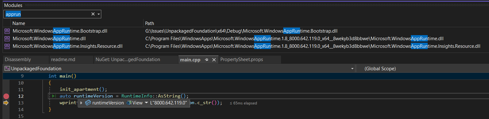

# Unpackaged, FWP-dependent, a la carte WinAppSDK Component App

This sample demonstrates how to add an a la carte Windows App SDK component reference, in this case
Microsoft.WindowsAppSDK.Foundation, versus referencing the entire metapackage.  Normally, this alone
would default to a self-contained WinAppSDK deployment.  But by also adding a reference to the
Microsoft.WindowsAppSDK.Runtime package, the bootstrapper auto-initializer logic for unpackaged apps
is enabled, allowing the app to be FWP-dependent (not self-contained).

